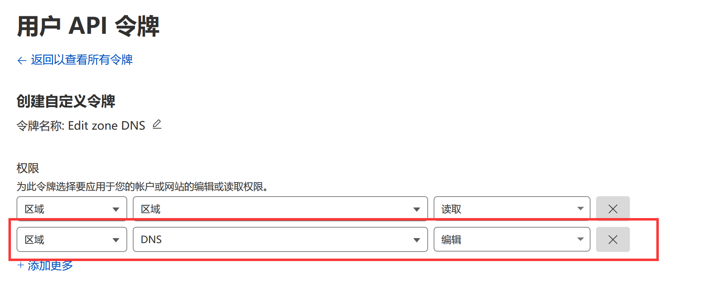

## 概述

本文主要介绍如何在 k3s 上为服务配置 https 证书(cloudflare)

## 准备环境

- cloudflare: 域名编辑权限 API Token
- 域名
- 已安装 k3s 的机器

## 目标

在 k3s 上暴露的服务访问会携带已发布认证的 HTTPS 证书

## 步骤

### 安装 cert-manager

参考: https://cert-manager.io/docs/installation/

可使用 helm 进行更简易的安装

安装好后可以执行如下命令查看命名空间是否建立:
```sh
$ kubectl get ns

NAME              STATUS   AGE
kube-system       Active   46h
kube-public       Active   46h
kube-node-lease   Active   46h
default           Active   46h
develop           Active   44h
cert-manager      Active   27h # 已建立
```

查看 pods 是否正常工作:
```sh
kubectl get pods -n cert-manager

NAME                                      READY   STATUS    RESTARTS   AGE
cert-manager-cainjector-c7d4dbdd9-xfjdn   1/1     Running   0          27h
cert-manager-6dc66985d4-n5crn             1/1     Running   0          27h
cert-manager-webhook-847d7676c9-rz4ld     1/1     Running   0          27h
```

### 配置 DNS 解析

首先在 DNS 服务商配置临时 DNS 解析, 并以 cloudflare 为例, 需获取编辑 DNS 权限的 API Token

eg: 已配置一条 hello-world 解析到主机中, 地址任意填写


并进入个人账号 - API 令牌页面, 创建编辑 DNS 权限 Token:




### 在默认命名空间上暴露服务

> 参考: https://medium.com/@kevinlutzer9/managed-ssl-certs-for-a-private-kubernetes-cluster-with-cloudflare-cert-manager-and-lets-encrypt-7987ba19044f

创建 `issuer.yml` 文件, 该文件告知 cert-manager 如何获取证书

```yaml
apiVersion: cert-manager.io/v1
kind: Issuer
metadata:
  name: ca-issuer
spec:
  acme:
    email: <YOUR EMAIL> # 替换为你的邮箱
    server: https://acme-v02.api.letsencrypt.org/directory
    privateKeySecretRef:
      name: issuer-key
    solvers:
    - dns01:
        cloudflare:
          email: <YOUR EMAIL> # 替换为你的 cloudflare 邮箱账号
          apiTokenSecretRef:
            name: cloudflare-api-key-secret # 此处值不需要修改
            key: api-key # 此处值不需要修改
```

我们需要创建一个 Secret 而非写入到文件 k3s 管理, 名称为上面填写的 `cloudflare-api-key-secret`:

```sh
# Token 替换为 cloudflare 的 API Token
kubectl create secret generic cloudflare-api-key-secret --from-literal=api-key=<TOKEN>
```

这样就告知 k3s 从哪里获取 secret

执行命令以生效:

```sh
kubectl apply -f issuer.yml
```

创建 `certificate.yml` 文件, 该文件告知 cert-manager 需要分发的证书域名

```yaml
apiVersion: cert-manager.io/v1
kind: Certificate
metadata:
  name: hello-world-ca-tsl  # 可替换, 当前仅测试分发用
spec:
  duration: 2160h # 90d
  renewBefore: 360h # 15d
  subject:
    organizations:
      - testorganization # 可填写任意值
  privateKey:
    algorithm: RSA
    encoding: PKCS1
    size: 2048
  dnsNames:
    - hello-world.<YOUR DOMAIN> # 替换为你的域名, 本次以 hello-world 为例
  secretName: hello-world-ca-tsl # 可替换, 当前仅测试分发用
  issuerRef:
    name: ca-issuer
    kind: Issuer
    group: cert-manager.io
```

执行命令以生效:

```sh
kubectl apply -f certificate.yml
```

执行命令, 查看证书分发情况:
```sh
kubectl get certificate

NAME                 READY   SECRET               AGE
hello-world-ca-tsl   True    hello-world-ca-tsl   100s
```

> 注意: apply 后, READY 状态为 False, 证书需要耗时较长时间获取, 视运营商及网络情况, 通常为数分钟


此时我们创建一个 `hello-world.yml` 用来部署, 并绑定 tls 证书即可

```yaml
apiVersion: apps/v1
kind: Deployment
metadata:
  name: nginx # Name of the deployment
  labels:
    app: nginx # Name of your application
spec:
  selector:
    matchLabels:
      app: nginx # Name of your application
  replicas: 1 # Number of replicas
  template:
    metadata:
      labels:
        app: nginx # Name of your application
    spec:
      containers:
      - name: nginx # Name of the container
        image: nginx:latest # The image you want to run
        ports:
        # Ports are the ports that your application uses.
        - containerPort: 80 # The port that your application uses
        readinessProbe:
          tcpSocket:
            port: 80
          initialDelaySeconds: 5
          periodSeconds: 10
        livenessProbe:
          tcpSocket:
            port: 80
          initialDelaySeconds: 15
          periodSeconds: 20
---
apiVersion: v1
kind: Service
metadata:
  name:  nginx
spec:
  selector:
    app:  nginx
  type:  ClusterIP
  # ClusterIP means this service can be accessed by any pod in the cluster
  ports:
  - name:  http
    port:  80
---
apiVersion: networking.k8s.io/v1
kind: Ingress
metadata:
  name: nginx # Name of the ingress object
spec:
  tls:
    - hosts:
      - hell-world.<YOUR DOMAIN> # 签名的证书域名, 替换为你的域名
      secretName: hello-world-ca-tsl # 注意: 此时的名称与之前填写的一致
  rules:
  - host: hell-world.<YOUR DOMAIN>  # 替换为你的域名
    http:
      paths:
      # Path-based routing settings:
      - path: /
        pathType: Prefix
        backend:
          service:
            name: nginx  # The name of the service
            port:
              number: 80  # Service Portnumber
```

执行命令以生效:
```sh
kubectl apply -f hello-world.yml
```

大功告成, 此时通过浏览器访问域名(hello-world.*), 应当正确的显示证书

### 更换命名空间

通常, 我们业务应用不是部署在 default 的命名空间中, 需要更换命名空间

假设需要签名的目标命名空间为 `staging`

首先, 我们需要重新创建 issuer, 创建 `issuer-staging.yml`, 内容与上面一致, 仅需稍作修改:

```yaml
apiVersion: cert-manager.io/v1
kind: Issuer
metadata:
  name: ca-issuer
  # 增加命名空间配置
  namespace: staging
spec:
  acme:
    email: <YOUR EMAIL> # 替换为你的邮箱
    server: https://acme-v02.api.letsencrypt.org/directory
    privateKeySecretRef:
      name: issuer-key
    solvers:
    - dns01:
        cloudflare:
          email: <YOUR EMAIL> # 替换为你的 cloudflare 邮箱账号
          apiTokenSecretRef:
            name: cloudflare-api-key-secret # 此处值不需要修改
            key: api-key # 此处值不需要修改
```

业务应用部署命名空间示例:
```yaml
apiVersion: apps/v1
kind: Deployment
metadata:
  name: nginx # Name of the deployment
  namespace: staging # Name of the namespace
  labels:
    app: nginx # Name of your application
spec:
  selector:
    matchLabels:
      app: nginx # Name of your application
  replicas: 1 # Number of replicas
  template:
    metadata:
      labels:
        app: nginx # Name of your application
    spec:
      containers:
      - name: nginx # Name of the container
        image: nginx:latest # The image you want to run
        ports:
        # Ports are the ports that your application uses.
        - containerPort: 80 # The port that your application uses
        readinessProbe:
          tcpSocket:
            port: 80
          initialDelaySeconds: 5
          periodSeconds: 10
        livenessProbe:
          tcpSocket:
            port: 80
          initialDelaySeconds: 15
          periodSeconds: 20
---
apiVersion: v1
kind: Service
metadata:
  name:  nginx
  namespace: staging
spec:
  selector:
    app:  nginx
  type:  ClusterIP
  # ClusterIP means this service can be accessed by any pod in the cluster
  ports:
  - name:  http
    port:  80
---
apiVersion: networking.k8s.io/v1
kind: Ingress
metadata:
  name: nginx # Name of the ingress object
  namespace: staging # Name of the namespace
spec:
  tls:
    - hosts:
      - nginx-k3s.<YOUR DOMAIN>
      secretName: nginx-k3s-ca-tsl
  rules:
  - host: "nginx-k3s.<YOUR DOMAIN>"  # Your hostname
    http:
      paths:
      # Path-based routing settings:
      - path: /
        pathType: Prefix
        backend:
          service:
            name: nginx  # The name of the service
            port:
              number: 80  # Service Portnumber

---
# 注意此处的 Certificate kind
apiVersion: cert-manager.io/v1
kind: Certificate
metadata:
  name: nginx-k3s-ca-tsl
  namespace: staging
spec:
  duration: 2160h # 90d
  renewBefore: 360h # 15d
  subject:
    organizations:
      - myorganization
  privateKey:
    algorithm: RSA
    encoding: PKCS1
    size: 2048
  dnsNames:
    - nginx-k3s.<YOUR DOMAIN>
  secretName: nginx-k3s-ca-tsl
  issuerRef:
    name: ca-issuer
    kind: Issuer
    group: cert-manager.io
```
